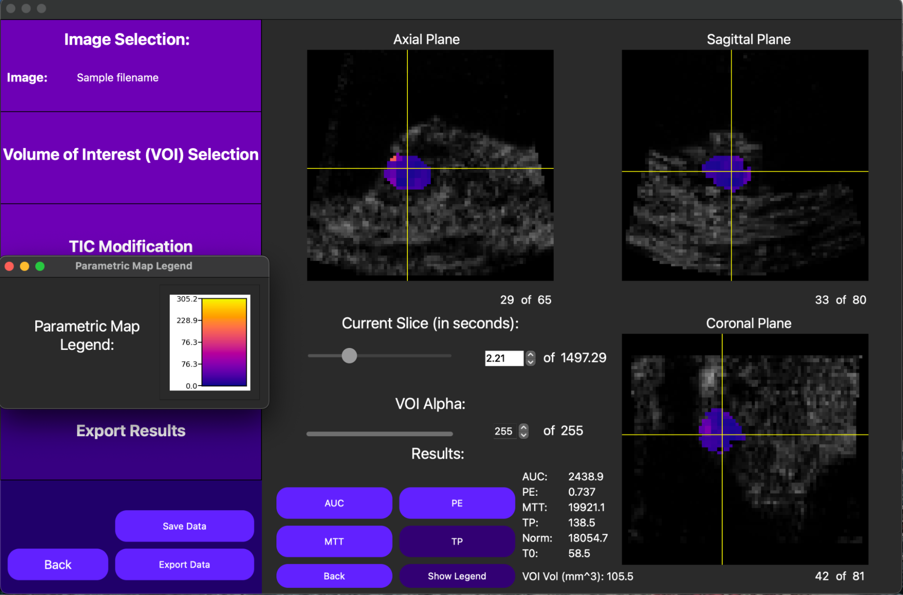

<p align="center">
  
</p>

#

QuantUS is a free, standalone, native graphical user interface (GUI) facilitating ultrasound research compatible on Mac OS X, Windows, and Linux. The tool provides an end-to-end workflow for analysis using radiomics approaches including:

* 2D Quantitative Ultrasound Spectroscopy (QUS) via spectral analysis of radiofrequency (RF) and in-phase and quadrature (IQ) data
* 2D Dynamic Contrast-Enhanced Ultrasound (DCE-US) Perfusion Imaging Analysis with optional Motion Compensation
* 3D DCE-US Perfusion Imaging Analysis

Notably, QuantUS addresses shortcomings in existing state-of-the-art tools by supporting 3D parametric map generation, motion compensation for 2D DCE-US analysis, an ultrasound system-independent approach, and an intuitive user interface. For more information, see our [website](https://quantus.webflow.io).

## QUS Overview

Given user-inputted RF or IQ ultrasound data, this feature runs spectral analysis to compute quantitative ultrasound parameters and parametric maps on a custom region of interest (ROI). In QuantUS, the midband fit (MBF), spectral slope (SS), and spectral intercept (SI) spectral parameters as described by [El Kaffas et al.](https://pubmed.ncbi.nlm.nih.gov/26233222/) have been validated and used in numerous ultrasound studies. Additionally, the backscatter coefficient, attenuation coefficient, Nakagami parameter, effective scatterer size, and effecive scatterer concentration have all been implemented into the UI and are in the validation process.

The QUS feature of QuantUS also supports a CLI for Terason and Canon transducers. More information and an example can be found in [scCanonQus.ipynb](CLI-Demos/scCanonQus.ipynb) and [terasonQus.ipynb](CLI-Demos/terasonQus.ipynb).


## DCE-US Overview

For both 2D and 3D cine loops, QuantUS performs quantitative analysis on bolus contrast injections by computing a time intensity curve (TIC) for a given ROI or volume of interest (VOI). 2D cine loops can optionally run a 2D motion compensation algorithm developed by [Tiyarattanachai et al.](https://pubmed.ncbi.nlm.nih.gov/35970658/) before the TIC is computed to reduce motion-induced noise.

From here, a lognormal curve is fitted, returning the area under the curve (AUC), peak enhancement (PE), mean transit time (MTT), time to peak (TP), normalization (TMPPV), and region area/volume values. For processors with high computational power, a parametric map of each parameter can be generated in both 2D and 3D as well.



## Requirements

* [Python](https://www.python.org/downloads/)

## Environment

First, download [Python3.11.8](https://www.python.org/downloads/release/python-3118/) (non-Conda version) from the Python website. Once installed, note its path. We will refer to this path as `$PYTHON` below.

Next, complete the following steps. Note lines commented with `# Unix` should only be run on MacOS or Linux while lines commented with `# Windows` should only be run on Windows.

```shell
git clone https://github.com/TUL-Dev/QuantUS.git
cd QuantUS
$PYTHON pip install virtualenv
$PYTHON -m virtualenv .venv
source .venv/bin/activate # Unix
call .venv\bin\activate.bat # Windows
pip install -r requirements.txt
```

Following this example, this environment can be accessed via the `source .venv/bin/activate` command from the repository directory.

## Building

After configuring a Python virtual environment, finish preparing QuantUS to be run using the following commands:

```shell
# Using Python virtual env (Mac/Linux)
chmod +x saveQt.sh
./saveQt.sh

# Using Python virtual env (Windows)
ren saveQt.sh saveQt.bat
.\saveQt.bat
```

## Running

### Mac/Linux

```shell
source venv/bin/activate
python main.py
```

### Windows

```shell
call venv\scripts\activate.bat
python main.py
```

## Phantom Collection Google Folder

This folder contains minimal sample data required to get each feature of
QuantUS working. Note that since phantom data must be collected using
identical transducer settings as the images they're compared to, we
do not recommend using phantoms from this folder for analysis on custom
data.

### Installation

This dataset can be installed locally using our Python virtual environment. Specifically, the commands for installation are

```shell
source venv/bin/activate | call venv\Scripts\activate.bat
python sampleData.py
```
